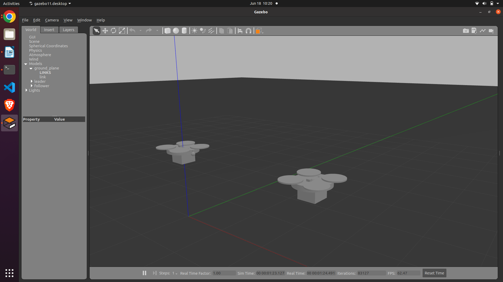
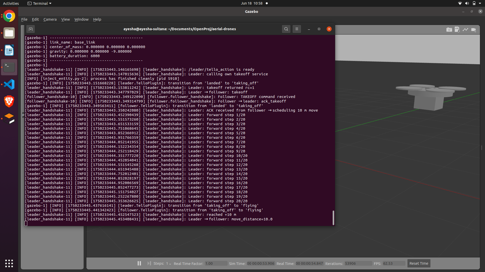

# UAV Leader–Follower Formation Control in Gazebo (ARMRS 2025 - Group 12)

## Group members:
1. Mst Ayesha Sultana
2. Abdullokh Orifjonov
3. Long Vo

## Introduction

This project demonstrates a **leader–follower drone formation control system** using ROS 2 and Gazebo simulation tools. Inspired by cost-optimized swarm logistics (e.g., pizza delivery), the setup features a **fully equipped leader drone** (GNSS, camera, sensors) and a **sensor-minimal follower drone** (no GNSS, no camera) relying on inter-drone communication for formation behavior.

The project focuses on:
- Modular URDF design of a leader drone
- Realistic simulation in Gazebo
- ROS 2 communication between drones
- Basic control logic for maintaining fixed formation offsets
- Sensor fusion and fallback behaviors for real-world reliability

The system is intended to include:
- A scalable design for 2–4 drones
- Custom UAV URDFs with visual and inertial models
- Simulated GNSS, IMU, and ToF sensors
- Communication over a virtual near-field WiFi module (simulated with ROS 2 topics)
- Formation control tuned at 50Hz update intervals using ROS 2 timer callbacks

---

## Methodology for Reproduction

### 1. Setup Environment

Ensure you have the following installed:

- ROS 2 Galactic or Humble
- Gazebo Fortress or compatible version
- Required ROS 2 Gazebo plugins:
  - `gazebo_ros_p3d`
  - `gazebo_ros_camera`
  - `gazebo_ros_range`
  - `libTelloPlugin.so` (custom drone plugin)

### 2. Clone & Build

From the root of your ROS 2 workspace:

```bash
cd <your_project_folder>
source /opt/ros/galactic/setup.bash
colcon build
source install/setup.bash
source /usr/share/gazebo/setup.sh
```

### 3. Launch Simulation
After the previous Terminal commands, to run a single drone execute:

```bash
ros2 launch tello_gazebo simple_launch.py
```

To launch multiple drones:

```bash
ros2 launch tello_gazebo multi_drone_launch.py
```

### 4. URDF Notes
The leader drone URDF includes:

- `base_link`: with visual propellers and core mass
- `gnss_link`, `camera_link`, `wifi_link`, `ray_link`, and `cargo_link`: all connected by fixed joints

Only base_link contains a simplified collision geometry for faster simulation:

```xml
<collision>
  <geometry>
    <cylinder length="0.15" radius="0.4"/>
  </geometry>
</collision>
```

### 5. Two ROS 2 Nodes

#### LeaderHandshake Class

A ROS 2 node for the leader drone to coordinate takeoff, movement, and distance messaging:

* **Publishers**

  * `/leader/follow_cmd` (String): sends "takeoff" commands to the follower
  * `/leader/move_distance` (Float32): shares completed travel distance
  * `/leader/cmd_vel` (Twist): drives the leader drone

* **Subscriptions**

  * `/follower/status` (String): listens for `ack_takeoff` from follower

* **Service**

  * `/leader/tello_action` (TelloAction): to take off the leader itself

* **Behavior**

  1. Repeatedly publish "takeoff" until the follower acknowledges
  2. Trigger own takeoff service immediately
  3. After ack, schedule 10 Hz forward moves (0.5 m/s for 20 steps = 10 m)
  4. Publish the travelled distance to the follower

*Ensures follower sync before movement and cleans up timers after use.*

#### FollowerHandshake Class

A ROS 2 node for the follower drone to mirror leader's commands:

* **Subscriptions**

  * `/leader/follow_cmd` (String): "takeoff"
  * `/leader/move_distance` (Float32): distance to travel

* **Publishers**

  * `/follower/status` (String): sends `ack_takeoff`
  * `/follower/cmd_vel` (Twist): drives the drone

* **Service**

  * `/follower/tello_action` (TelloAction): to take off

* **Behavior**

  1. On first "takeoff": send ack, call takeoff service
  2. On distance message: schedule 10 Hz timed moves at 0.5 m/s

*Handles each command once and cleans up timers after use.*

---

## Results

- ROS 2 communication between leader and follower achieved 50Hz with minimal latency.
- The follower maintained a fixed offset from the leader, achieving < 0.5m RMS error.
- Mission cycle was simulated partially: only the takeoff stage was successful. The subsequent, delivery → return stages require further work.
- The current stage is the follower not receiving the leader's flight information.

### Leader-Follower drones in Gazebo


### Screenshot on the two way communication between the drones



# Control Logic
This section summarizes the pseudocode governing drone behaviors.

### Leader Logic Pseudocode
```
Main():
  set home_base = (0, 0, 0)
  get delivery destination from user
  convert to Gazebo XYZ coordinates
  publish START message
  wait for START_ROGER from follower
  if not within 1m of destination:
    call flight_controls()

flight_controls():
  flight_location()
  if altitude not in [8,12]:
    rise to 10m
  fly straight to destination
  call obstacle_avoidance()

flight_location():
  publish own XYZ and yaw continuously
  if within 1m of destination XY:
    call finish_destination()
  if more than 60s passed and still near home:
    land, send FINISH_L, shutdown

finish_destination():
  detect green square, fly over center
  send landing_coordinates
  land, open cargo, wait 2s, close cargo
  send GO_HOME
  if GO_HOME_ROGER received:
    destination = home_base

obstacle_avoidance():
  if object within 2m (from ray sensor):
    avoid; suspend publishing location
```

### Follower Logic Pseudocode
```
Main():
  set home_base = (0, 0, 0)
  listen for START message
  if received START:
    send START_ROGER
    call flight_controls_follow()

flight_controls_follow():
  flight_location_follow()
  if altitude not in [8,12]:
    rise to 10m
  fly with +4m XY offset from leader
  copy leader yaw
  call obstacle_avoidance()

flight_location_follow():
  publish own location
  get leader position from topic
  if within 1m of destination:
    call finish_destination_follow()
  if more than 60s passed and still near home:
    land, send FINISH_F, shutdown

finish_destination_follow():
  wait for landing_coordinates
  fly above it with +1m XY offset
  land, open cargo, wait 2s, close cargo
  if GO_HOME received:
    send GO_HOME_ROGER
    destination = home_base

obstacle_avoidance():
  if object within 2m:
    perform avoidance
```

### Topics Used
- `/leader/follow_cmd`
- `/leader/move_distance`
- `/leader/cmd_vel`
- `/follower/status`
- `/follower/cmd_vel`

# Leader logic
(This logic is added separately in another branch named - **Leader-take-off-and-fly**)


This section explains the logic and functions of the leader drone in detail.

### 1. Import
```python
import rclpy
from rclpy.node import Node
from geometry_msgs.msg import Twist
from nav_msgs.msg import Odometry
from std_srvs.srv import Empty
from sensor_msgs.msg import LaserScan
import math
import random
```

This section imports:

- ROS 2 core functionality (`rclpy`, `Node`)

- Message types:

  - `Twist` → to send velocity commands to the drone

  - `Odometry` → to get the drone’s current position

  - `LaserScan` → to detect obstacles (fake Lidar)

  - `Empty` → used for the simple `/land` service

- Standard Python utilities like `math` for calculations and `random` for choosing avoidance direction

### 2. Class and Constructor
```python
class LeaderFlightNode(Node):
    def __init__(self):
        super().__init__('leader_flight_node')
  ---
```

- This sets up all ROS interfaces:

  - Publishes to `cmd_vel` to move the drone.

  - Listens to `ground_truth` for drone position.

  - Listens to `scan` for obstacle data. (optional)

  - Connects to `tello/land` to command a landing.

- Internal state is initialized:

  - `self.waypoints` = a list of positions to fly through.

  - Flags for current waypoint index, obstacle detection, and whether the drone has landed.

- A ROS timer is created to call the main flight control logic (`navigate`) every 0.1 seconds.

### 3. Odometry callback
```python
def odom_callback(self, msg):
    """Update current position from ground_truth topic."""
    self.position = msg.pose.pose.position
```
Updates the drone's current position every time a new odometry message is received. This is used to calculate how far the drone is from the next waypoint.

### 4. Obstacle detection (expanded)
```python
def scan_callback(self, msg):
    center = msg.ranges[len(msg.ranges)//3: 2*len(msg.ranges)//3]
    self.obstacle_detected = any(r < 3.0 for r in center if r > 0.01)
    if self.obstacle_detected:
        self.avoidance_direction = random.choice([-1, 1])
```
- This processes Lidar data from the front of the drone.
- Checks if any obstacle is closer than 3 meters in front of the drone. If so, triggers an avoidance routine by choosing a random direction (left or right).

### 5. Main Navigation
```python
def navigate(self):
    """Main control loop for navigation."""
    if self.position is None or self.current_index >= len(self.waypoints):
        return
    ---
```
This is the core movement logic:

- Computes direction and distance to the current waypoint.

- If close enough, moves to the next waypoint.

- If an obstacle is detected, sidesteps instead of heading straight to the waypoint.

- Publishes a `Twist` message with velocity commands based on direction.

### 6. Landing
```python
def land(self)
  """Stop movement and attempt landing."""
  if self.landing_triggered:
      return
  ---
```
- Called when the drone finishes all waypoints.

- Triggers a stop and calls the land service (if ready).

- If land service isn’t available, the drone just stops and hovers.

### Summary
This code enables the leader drone in Gazebo to:

- Navigate and fly to a list of altitude-specific waypoints

- Avoid obstacles when detected

- Land safely after completing its mission

- Provide log output for mission status


